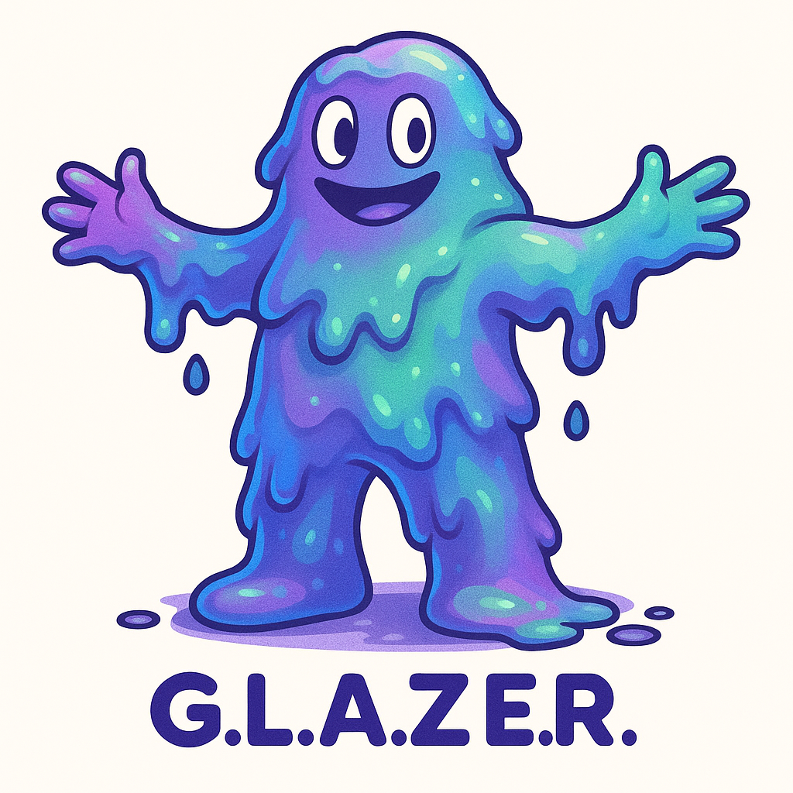

# G.L.A.Z.E.R. - Generative Listening And Zoned Engagement Runtime

> _A modular, high-fidelity, AI-driven Discord bot for streaming, speaking, and stirring up trouble._

---

## 🧠 What is G.L.A.Z.E.R.?
**G.L.A.Z.E.R.** (Generative Listening And Zoned Engagement Runtime) is a next-generation Discord bot written in **C++**, featuring a highly modular microservice architecture. It is designed to deliver **ultra-low-latency, high-fidelity audio streaming**, **real-time interaction**, **AI conversation**, and **on-demand image generation**, all while being toggleable, extensible, and edgy as hell.

---

## 🎯 Core Features (Planned)

### 🎵 Audio Streaming
- Stream music/audio from YouTube and other sources via yt-dlp
- Local audio broadcast from a controlling user's PC
- Opus or PCM pipeline with FFmpeg decoding
- Seamless transitions and pre-buffering
- Voice connection lifecycle handling

### 🗣️ Conversational AI
- Integrate with a local LLM (e.g. llama.cpp, Mistral)
- Proactive interaction: GPT-like chatter, comments, reactions
- Thread-safe message queues for bot responses

### 🎨 Image Generation
- HuggingFace-compatible Stable Diffusion backend
- Optional NSFW filtering
- Prompt-to-image, with queueing and style presets

### 🧩 Modular Services
- Subsystems can be enabled/disabled at runtime
- Memory and resource cleanup upon unload
- IPC via sockets/gRPC for inter-service communication

---

## 🧩 Subsystems Overview

| Subsystem         | Description                                      |
|------------------|--------------------------------------------------|
| 🎧 `audio-engine`   | Core audio playback engine (FFmpeg-based)        |
| 💬 `chat-core`      | GPT-like service (local LLM microservice)        |
| 🧠 `llm-backend`     | Optional Mistral/llama.cpp server                |
| 🎨 `img-generator`  | Stable Diffusion backend service                |
| 🔧 `controller`     | CLI + configuration + microservice loader       |
| 📊 `logger`         | Structured logging & telemetry service          |
| 💾 `datastore`      | PostgreSQL (or file-based) persistent storage   |

---

